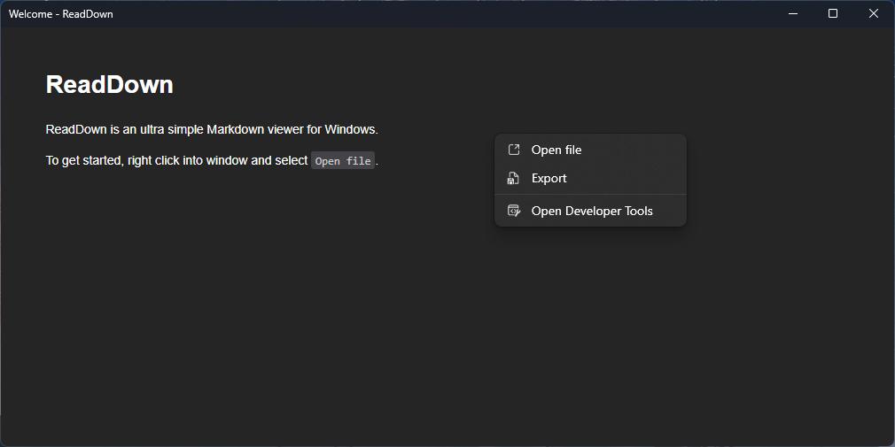

# ReadDown

ReadDown is a fluent and easy to use Markdown reader.

It converts Markdown to HMTL via [Markdig](https://github.com/xoofx/markdig) and renders it via [Edge WebView2](https://developer.microsoft.com/en-us/microsoft-edge/webview2/).
Also supports exporting to other formats like `.docx`, `.pdf` and `.html`.

## Installation

Get your installer from [releases](https://github.com/Segilmez06/ReadDown/releases/latest) page.

## Screenshots

## Contributing

You can create pull requests and issues to help development.

## Credits

Created by Segilmez06
